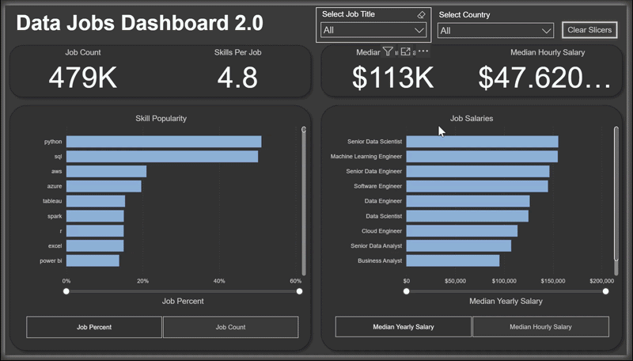
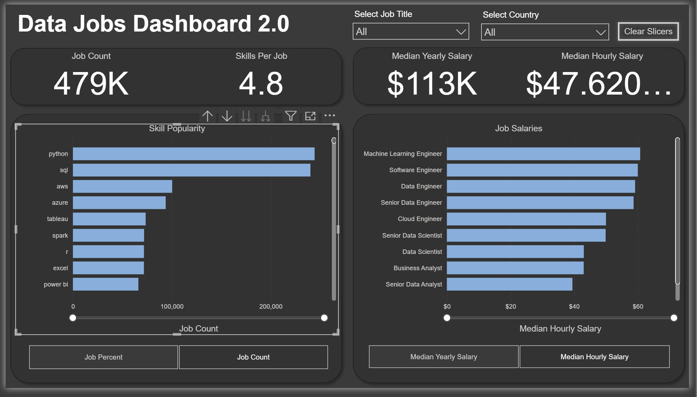

# 💼 Data Jobs Market Dashboard 2.0 — Power BI

> **Power BI · DAX · Star Schema · Single-Page Design · Skill Intelligence · 2024 Job Postings**

## 🌐 Live Interactive Dashboard

[](https://app.powerbi.com/view?r=eyJrIjoiYjRjYmY2MDAtZTk2NC00YWM3LTkwZWQtOGU1NWM5YTM5OTM0IiwidCI6ImU5ODI3YzRkLWU5NDEtNDM1OC05ZmY1LTZhNDI1YTBmZDQzMiJ9)

> Click above to explore the fully interactive V2.0 dashboard on Power BI 
> Service — filter by job title and country, toggle between skill count 
> and job percent views. No download required.

## 🎬 Dashboard Demo



---

## 📸 Dashboard Preview



---

## 🔍 Project Overview

This is **Version 2.0** of the Data Jobs Market Dashboard — a redesigned, single-page Power BI report built on the same real-world dataset of **478,895 data science job postings from 2024**. This iteration prioritizes speed and clarity: a recruiter or job seeker gets every critical market signal — salaries, skills, job counts, and hiring trends — without navigating between pages.

The upgrade from V1 reflects a deliberate design decision: consolidation. In operational analytics contexts (healthcare, supply chain, clinical ops), executive dashboards are expected to surface key decisions on a single view. This project demonstrates that design philosophy directly.

---

## 🔄 What's New in V2.0

| Feature | V1.0 | V2.0 |
|---|---|---|
| **Pages** | 2 (Overview + Drill-Through) | 1 (consolidated) |
| **Data Model** | Implicit measures | Explicit DAX measures |
| **Design approach** | Exploratory multi-page | Focused single-page |
| **Skill analysis** | Basic count | % of jobs + count toggle |
| **ETL depth** | Basic cleaning | Full Power Query transformation pipeline |
| **Chart variety** | Core charts | Core + uncommon chart types |

---

## 🎯 Business Problem

Version 2.0 sharpens the focus on the three questions data job seekers need answered fastest:

1. **What skills should I learn?** — Which skills appear in the highest % of postings for my target role?
2. **What should I expect to earn?** — Median yearly and hourly salary benchmarks by job title
3. **How competitive is each role?** — Job count comparison across all data titles

---

## 📁 Repository Structure

```
📦 data-jobs-dashboard-v2/
│
├── 📊 Data_Jobs_Dashboard_2_0.pbix
├── 📄 README.md
├── 📄 DATA_DICTIONARY.md
│
├── 📁 data/
│   ├── job_postings_fact.csv      ← 478,895 job posting records
│   ├── company_dim.csv            ← 98,372 company records
│   ├── skills_dim.csv             ← 254 unique skills
│   └── skills_job_dim.csv         ← 2,274,756 skill-job relationships
│
└── 📁 assets/
    └── dashboard_overview.png
```

---

## 📐 Dataset at a Glance

| Attribute | Details |
|---|---|
| **Source** | Real-world 2024 Data Science Job Postings |
| **Total Job Records** | 478,895 postings |
| **Date Range** | January 1, 2024 – December 31, 2024 |
| **Companies** | 98,372 unique employers |
| **Skills Tracked** | 254 unique skills across 8 categories |
| **Skill-Job Links** | 2,274,756 relationships |
| **Top Country** | United States — 140,365 postings |
| **Median Yearly Salary** | $113,250 across all roles |

---

## 📊 Dashboard Components

### 🔢 KPI Cards (Top Row)
Four headline metrics update dynamically based on the selected job title filter:
- **Job Count** — total postings for the selected role
- **Skills Per Job** — average number of skills required per posting
- **Median Yearly Salary** — annual compensation benchmark
- **Median Hourly Salary** — for contract and hourly roles

### 📊 Skill Popularity Panel
Toggle between two views:
- **% of Jobs** — what percentage of postings for this role require each skill
- **Count** — raw number of job postings requiring each skill

Top skills by demand (all roles combined):

| Rank | Skill | Job Mentions |
|---|---|---|
| 1 | Python | 244,416 |
| 2 | SQL | 240,179 |
| 3 | AWS | 100,386 |
| 4 | Azure | 93,849 |
| 5 | Tableau | 73,560 |
| 6 | Spark | 71,979 |
| 7 | R | 71,835 |
| 8 | Excel | 71,807 |
| 9 | Power BI | 66,183 |
| 10 | Java | 51,294 |

### 💰 Salary by Job Title
Horizontal bar chart comparing median salaries across all roles:

| Role | Median Yearly Salary |
|---|---|
| Senior Data Scientist | $155,500 |
| Machine Learning Engineer | $155,000 |
| Senior Data Engineer | $146,500 |
| Software Engineer | $145,000 |
| Data Engineer | $126,268 |
| Data Scientist | $125,000 |
| Senior Data Analyst | $107,310 |

---

## 🛠️ Power BI Skills Demonstrated

| Feature | Application |
|---|---|
| **Power Query ETL** | Full transformation pipeline — blanks, types, calculated columns, merges |
| **Star Schema Modeling** | Fact + 3 dimension tables with proper relationships |
| **Explicit DAX Measures** | `Median Yearly Salary`, `Median Hourly Salary`, `Job Count`, `Skills Per Job`, `% Jobs with Skill` |
| **Slicers** | Job title slicer filtering all visuals simultaneously |
| **Buttons & Bookmarks** | Toggle between skill count and skill % views |
| **Column / Bar Charts** | Salary comparison and skill frequency |
| **KPI Cards** | Dynamic headline metrics |
| **Table Visuals** | Detailed, sortable skill and salary data |
| **Uncommon Chart Types** | Selected for analytical storytelling beyond defaults |

---

## 📐 Data Model — Star Schema

```
                    ┌──────────────────────┐
                    │   job_postings_fact  │  ← CENTER FACT TABLE
                    │   (478,895 records)  │
                    └──────┬───────┬───────┘
                           │       │
            ┌──────────────┘       └──────────────┐
            ▼                                     ▼
   ┌────────────────┐                   ┌─────────────────┐
   │  company_dim   │                   │  skills_job_dim │
   │ (98,372 cos.)  │                   │  (2.27M rows)   │
   └────────────────┘                   └────────┬────────┘
                                                 │
                                                 ▼
                                        ┌─────────────────┐
                                        │   skills_dim    │
                                        │  (254 skills)   │
                                        └─────────────────┘
```

---

## 📌 Key Findings

1. **Python and SQL are non-negotiable** — they appear in 51% and 50% of all postings respectively; every data role requires at least one of them
2. **Only 13.2% of jobs are remote** — the return-to-office trend is real even in data fields
3. **$45,250 salary gap** between Senior Data Scientist ($155,500) and Senior Data Analyst ($107,310) — the "senior" jump matters more than the title change
4. **LinkedIn dominates hiring** — 31% of all 2024 data job postings were on LinkedIn; the second-largest platform (BeBee) had less than a third of that volume
5. **Data Engineer overtook Data Scientist** in raw job count (128,994 vs 97,664) — reflecting industry shift toward data infrastructure over pure modeling

---

## 🏥 Relevance to Target Roles

### Clinical Data Analyst / Healthcare Operations

| Dashboard Element | Healthcare Equivalent |
|---|---|
| KPI cards (salary, count, skills/job) | Scorecard reporting for clinical operations leadership |
| Skill demand % toggle | Required competency frequency across clinical roles |
| Single-page consolidated design | Executive-level clinical dashboard design pattern |
| DAX explicit measures | Calculated metrics in healthcare BI (ALOS, HCAHPS, readmission rates) |
| Star schema model | Structure identical to EHR data warehouses (fact + dimension tables) |

### Supply Chain & Logistics

| Dashboard Element | Supply Chain Equivalent |
|---|---|
| Job count by role | Order volume or SKU count tracking across product lines |
| Skill frequency ranking | Vendor competency or warehouse process benchmarking |
| Salary by title comparison | Cost benchmarking across fulfillment roles or carrier tiers |
| Single-page dashboard design | Operations center real-time KPI reporting |
| Power Query ETL pipeline | Data transformation from WMS/ERP exports |

---

## 🚀 How to Open This Dashboard

1. Download `Data_Jobs_Dashboard_2_0.pbix` from this repository
2. Open in **Power BI Desktop** (free — powerbi.microsoft.com)
3. All data is embedded — no external database connection required
4. Use the **Job Title slicer** to filter all KPIs and charts simultaneously
5. Use the **toggle buttons** on the Skills panel to switch between Count and % views

---

## 🔗 Related Project

📁 [Data Jobs Dashboard V1.0](https://github.com/KrishnaSai315/data-jobs-market-dashboard) — Two-page version with drill-through navigation and geospatial map analysis

---

## 📬 Connect

**Loknadh Venkata Krishna Sai Kona**
[](https://www.linkedin.com/in/lvkrishna3/)
[](mailto:loknadh.kona@gmail.com)
